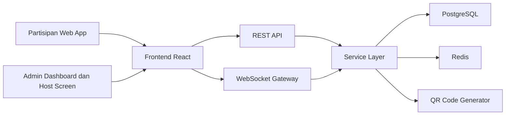
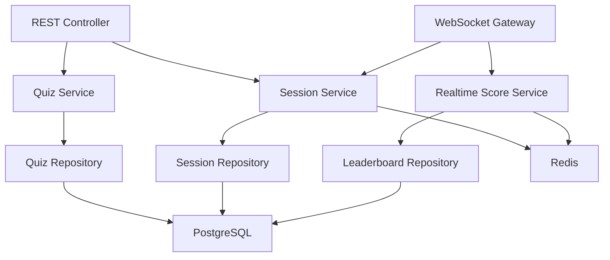
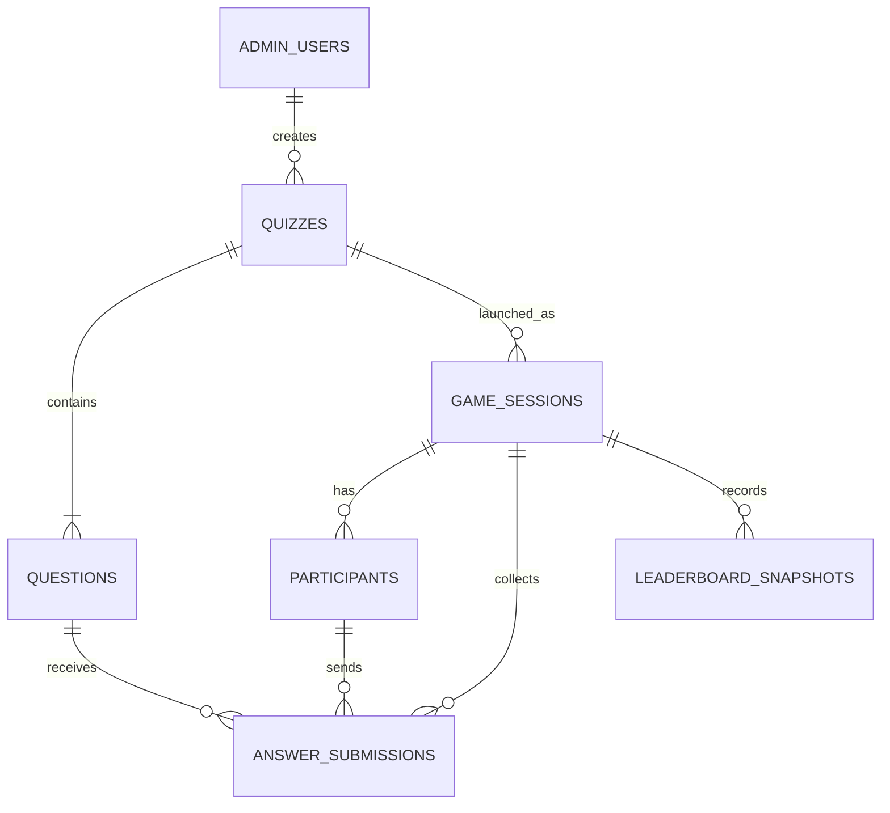

## 1. Desain Arsitektur



Arsitektur yang direkomendasikan adalah frontend SPA untuk partisipan dan admin, backend API terpisah yang menangani autentikasi, CRUD kuis, dan orkestrasi sesi live, serta WebSocket Gateway untuk sinkronisasi status permainan real-time. PostgreSQL menyimpan data persisten, sementara Redis dipakai untuk state sesi aktif, countdown, room presence, dan scale-out pub/sub.

## 2. Deskripsi Teknologi
- Frontend: `React 18 + TypeScript + Vite + Tailwind CSS + Zustand`
- Backend: `NestJS + TypeScript + Socket.IO`
- Database utama: `PostgreSQL`
- Cache dan state real-time: `Redis`
- ORM: `Prisma`
- Realtime transport: `WebSocket` melalui `Socket.IO`
- Charting host screen: `Recharts`
- QR code: `qrcode`
- Deployment: frontend di `Vercel` atau `Netlify`, backend dan Redis/PostgreSQL di `Railway`, `Render`, atau VM perusahaan

### Alasan Pemilihan Stack
- `React + Zustand` cocok untuk UI cepat, multi-state, dan perpindahan status game yang intens.
- `NestJS` memberi struktur enterprise yang rapi untuk modul admin, game session, dan websocket gateway.
- `Socket.IO` mempermudah room-based broadcast, ack, reconnect handling, dan fallback jaringan.
- `Redis` penting agar status sesi live tidak hanya bergantung pada memory satu instance server.
- `PostgreSQL` stabil untuk relasi kuis, pertanyaan, sesi, jawaban, dan histori permainan.

## 3. Definisi Rute
| Rute | Tujuan |
|------|--------|
| `/` | Halaman join partisipan untuk memasukkan `QUIZ ID` |
| `/join/:pin` | Validasi PIN dan input nama partisipan |
| `/lobby/:sessionId` | Lobby waiting room partisipan |
| `/play/:sessionId` | Halaman gameplay partisipan |
| `/result/:sessionId` | Status hasil soal untuk partisipan |
| `/finished/:sessionId` | Ringkasan akhir partisipan |
| `/admin/login` | Login admin |
| `/admin/quizzes` | Daftar kuis |
| `/admin/quizzes/new` | Membuat kuis baru |
| `/admin/quizzes/:quizId/edit` | Edit kuis dan pertanyaan |
| `/admin/sessions/:sessionId/lobby` | Host lobby dengan PIN dan QR code |
| `/admin/sessions/:sessionId/live` | Layar presentasi pertanyaan |
| `/admin/sessions/:sessionId/summary` | Grafik jawaban dan leaderboard sementara |
| `/admin/sessions/:sessionId/podium` | Podium pemenang final |

## 4. Definisi API

### 4.1 Tipe Data Inti
```ts
export type QuizStatus = 'draft' | 'published' | 'archived'
export type SessionStatus = 'waiting' | 'countdown' | 'question_live' | 'question_result' | 'leaderboard' | 'completed'

export interface Quiz {
  id: string
  title: string
  description: string
  status: QuizStatus
  createdBy: string
  createdAt: string
  updatedAt: string
}

export interface Question {
  id: string
  quizId: string
  orderNo: number
  text: string
  optionA: string
  optionB: string
  optionC: string
  optionD: string
  correctOption: 'A' | 'B' | 'C' | 'D'
  durationSeconds: number
}

export interface GameSession {
  id: string
  quizId: string
  pinCode: string
  status: SessionStatus
  currentQuestionIndex: number
  startedAt?: string
  endedAt?: string
}

export interface Participant {
  id: string
  sessionId: string
  displayName: string
  score: number
  rank: number
  connected: boolean
}
```

### 4.2 REST API
| Method | Endpoint | Tujuan |
|--------|----------|--------|
| `POST` | `/api/admin/auth/login` | Login admin |
| `GET` | `/api/admin/quizzes` | Mengambil daftar kuis |
| `POST` | `/api/admin/quizzes` | Membuat kuis |
| `GET` | `/api/admin/quizzes/:quizId` | Mengambil detail kuis |
| `PATCH` | `/api/admin/quizzes/:quizId` | Memperbarui kuis |
| `DELETE` | `/api/admin/quizzes/:quizId` | Menghapus kuis |
| `POST` | `/api/admin/quizzes/:quizId/questions` | Menambah pertanyaan |
| `PATCH` | `/api/admin/questions/:questionId` | Mengedit pertanyaan |
| `DELETE` | `/api/admin/questions/:questionId` | Menghapus pertanyaan |
| `POST` | `/api/admin/sessions` | Membuat sesi live baru dari kuis |
| `POST` | `/api/admin/sessions/:sessionId/start` | Memulai permainan |
| `POST` | `/api/admin/sessions/:sessionId/next` | Lanjut ke pertanyaan berikutnya |
| `POST` | `/api/admin/sessions/:sessionId/finish` | Menutup sesi |
| `POST` | `/api/player/join` | Validasi PIN dan join sesi |
| `GET` | `/api/player/sessions/:sessionId/state` | Mengambil state sesi terkini |

### 4.3 Contoh Skema Request dan Response
```ts
export interface JoinSessionRequest {
  pinCode: string
  displayName: string
}

export interface JoinSessionResponse {
  participantId: string
  sessionId: string
  sessionStatus: SessionStatus
  quizTitle: string
}

export interface CreateSessionRequest {
  quizId: string
}

export interface CreateSessionResponse {
  sessionId: string
  pinCode: string
  qrCodeUrl: string
  status: 'waiting'
}
```

### 4.4 Event WebSocket
| Event | Arah | Tujuan |
|------|------|--------|
| `session:join` | Client -> Server | Partisipan masuk ke room sesi |
| `session:joined` | Server -> Client | Konfirmasi join dan state awal |
| `participant:joined` | Server -> Host | Broadcast pemain baru |
| `session:state` | Server -> All | Update status sesi live |
| `question:start` | Server -> All | Menyiarkan soal aktif dan deadline |
| `answer:submit` | Client -> Server | Mengirim jawaban partisipan |
| `answer:accepted` | Server -> Client | Konfirmasi jawaban diterima |
| `question:result` | Server -> Client | Hasil benar/salah dan poin |
| `question:analytics` | Server -> Host | Distribusi jawaban |
| `leaderboard:update` | Server -> All | Ranking terbaru setelah tiap soal |
| `session:completed` | Server -> All | Menutup sesi dan memicu podium |

## 5. Diagram Arsitektur Server



### Prinsip Back-End
- `Controller` menangani validasi request admin dan player.
- `WebSocket Gateway` menangani koneksi room, reconnect, dan broadcast sinkron.
- `Session Service` menjadi sumber kebenaran untuk urutan soal, timer, dan perubahan status.
- `Realtime Score Service` menghitung skor berdasarkan ketepatan dan kecepatan.
- `Redis` menyimpan state ephemeral seperti peserta aktif, countdown deadline, dan jawaban yang sudah masuk.

## 6. Model Data

### 6.1 Definisi Relasi Data


### 6.2 Skema Database Dasar
| Tabel | Fungsi |
|------|--------|
| `admin_users` | Menyimpan akun admin |
| `quizzes` | Metadata kuis |
| `questions` | Daftar pertanyaan per kuis |
| `game_sessions` | Instance permainan live per kuis |
| `participants` | Peserta yang bergabung pada suatu sesi |
| `answer_submissions` | Jawaban setiap peserta pada setiap pertanyaan |
| `leaderboard_snapshots` | Ranking agregat setelah tiap ronde |

### 6.3 DDL Awal
```sql
create table admin_users (
  id uuid primary key default gen_random_uuid(),
  email varchar(255) not null unique,
  password_hash text not null,
  full_name varchar(120) not null,
  created_at timestamptz not null default now()
);

create table quizzes (
  id uuid primary key default gen_random_uuid(),
  title varchar(160) not null,
  description text not null default '',
  status varchar(20) not null default 'draft',
  created_by uuid not null references admin_users(id),
  created_at timestamptz not null default now(),
  updated_at timestamptz not null default now()
);

create table questions (
  id uuid primary key default gen_random_uuid(),
  quiz_id uuid not null references quizzes(id) on delete cascade,
  order_no int not null,
  question_text text not null,
  option_a text not null,
  option_b text not null,
  option_c text not null,
  option_d text not null,
  correct_option char(1) not null check (correct_option in ('A', 'B', 'C', 'D')),
  duration_seconds int not null default 20,
  created_at timestamptz not null default now(),
  unique (quiz_id, order_no)
);

create table game_sessions (
  id uuid primary key default gen_random_uuid(),
  quiz_id uuid not null references quizzes(id),
  pin_code varchar(8) not null unique,
  status varchar(30) not null default 'waiting',
  current_question_index int not null default 0,
  started_at timestamptz,
  ended_at timestamptz,
  created_at timestamptz not null default now()
);

create table participants (
  id uuid primary key default gen_random_uuid(),
  session_id uuid not null references game_sessions(id) on delete cascade,
  display_name varchar(80) not null,
  score int not null default 0,
  current_rank int not null default 0,
  connected boolean not null default true,
  joined_at timestamptz not null default now()
);

create table answer_submissions (
  id uuid primary key default gen_random_uuid(),
  session_id uuid not null references game_sessions(id) on delete cascade,
  participant_id uuid not null references participants(id) on delete cascade,
  question_id uuid not null references questions(id) on delete cascade,
  selected_option char(1) not null check (selected_option in ('A', 'B', 'C', 'D')),
  is_correct boolean not null,
  response_time_ms int not null,
  score_awarded int not null default 0,
  submitted_at timestamptz not null default now(),
  unique (participant_id, question_id)
);

create table leaderboard_snapshots (
  id uuid primary key default gen_random_uuid(),
  session_id uuid not null references game_sessions(id) on delete cascade,
  question_id uuid references questions(id) on delete set null,
  rank_no int not null,
  participant_id uuid not null references participants(id) on delete cascade,
  score int not null,
  created_at timestamptz not null default now()
);

create index idx_questions_quiz_id on questions(quiz_id);
create index idx_game_sessions_quiz_id on game_sessions(quiz_id);
create index idx_participants_session_id on participants(session_id);
create index idx_answers_session_question on answer_submissions(session_id, question_id);
create index idx_leaderboard_session on leaderboard_snapshots(session_id, created_at desc);
```

## 7. Aturan Scoring dan Sinkronisasi
- Jawaban benar mendapatkan poin dasar dan bonus kecepatan.
- Formula rekomendasi: `score = 500 + floor((remainingMs / questionDurationMs) * 500)` untuk jawaban benar, `0` untuk jawaban salah.
- Server menjadi sumber kebenaran untuk timer, bukan browser client.
- Client menerima `question:start` dengan `deadlineAt`, lalu menampilkan countdown lokal yang tetap disinkronkan ke server.
- Pertanyaan ditutup jika deadline tercapai atau semua partisipan telah mengirim jawaban.

## 8. Struktur Proyek dan Kerangka Kode Utama

```text
truevindo-games/
  src/
    app/
      router.tsx
      providers.tsx
    components/
      common/
      participant/
      admin/
      host/
    pages/
      JoinPage.tsx
      ParticipantLobbyPage.tsx
      PlayPage.tsx
      ResultPage.tsx
      AdminLoginPage.tsx
      QuizListPage.tsx
      QuizEditorPage.tsx
      HostLobbyPage.tsx
      HostLivePage.tsx
      HostSummaryPage.tsx
      HostPodiumPage.tsx
    hooks/
      useSessionSocket.ts
      useCountdown.ts
    stores/
      useParticipantStore.ts
      useHostStore.ts
      useQuizEditorStore.ts
    utils/
      score.ts
      format.ts
  api/
    src/
      modules/
        auth/
        quizzes/
        sessions/
        participants/
        leaderboard/
      gateways/
        session.gateway.ts
      prisma/
        schema.prisma
  shared/
    types/
      quiz.ts
      session.ts
```

### Contoh Kerangka State Client
```ts
import { create } from 'zustand'

type SessionStatus =
  | 'waiting'
  | 'countdown'
  | 'question_live'
  | 'question_result'
  | 'leaderboard'
  | 'completed'

interface ParticipantState {
  sessionId: string | null
  participantId: string | null
  status: SessionStatus
  currentQuestionId: string | null
  selectedOption: 'A' | 'B' | 'C' | 'D' | null
  score: number
  setSession(payload: { sessionId: string; participantId: string }): void
  setStatus(status: SessionStatus): void
  submitLocalOption(option: 'A' | 'B' | 'C' | 'D'): void
}

export const useParticipantStore = create<ParticipantState>((set) => ({
  sessionId: null,
  participantId: null,
  status: 'waiting',
  currentQuestionId: null,
  selectedOption: null,
  score: 0,
  setSession: (payload) => set(payload),
  setStatus: (status) => set({ status }),
  submitLocalOption: (option) => set({ selectedOption: option }),
}))
```

### Contoh Gateway Event Handler
```ts
@SubscribeMessage('answer:submit')
handleAnswer(
  @ConnectedSocket() client: Socket,
  @MessageBody() payload: {
    sessionId: string
    participantId: string
    questionId: string
    selectedOption: 'A' | 'B' | 'C' | 'D'
    responseTimeMs: number
  },
) {
  return this.sessionRealtimeService.submitAnswer(client.id, payload)
}
```

## 9. Rekomendasi Implementasi Bertahap
1. Bangun modul admin dan CRUD kuis terlebih dahulu.
2. Tambahkan pembuatan sesi live, `QUIZ ID`, dan QR code.
3. Implementasikan room join partisipan dan waiting room real-time.
4. Implementasikan broadcast soal, submit jawaban, dan kalkulasi skor.
5. Tambahkan hasil jawaban, leaderboard, dan podium corporate celebration.
6. Terakhir, lakukan hardening untuk reconnect, session recovery, dan observability.
