# Truevindo Games

Dokumen ini disusun untuk kebutuhan presentasi produk dan solusi. Isinya dibuat lebih ringkas daripada dokumen teknis utama, dengan diagram sederhana, pesan utama per slide, dan poin bicara yang mudah dibawakan saat meeting.

## 1. Ringkasan Presentasi

### Judul Presentasi
**Truevindo Games: Platform Quiz Interaktif Real-Time untuk Event Corporate**

### Tujuan Presentasi
- Menjelaskan masalah yang diselesaikan oleh Truevindo Games.
- Menunjukkan alur penggunaan yang mudah dipahami oleh admin dan partisipan.
- Menjelaskan arsitektur sistem secara sederhana.
- Menunjukkan kesiapan produk untuk event perusahaan, training, dan engagement internal.

### Durasi Presentasi yang Disarankan
- 7 menit untuk versi singkat.
- 10 sampai 12 menit untuk versi lengkap.

## 2. Struktur Slide yang Disarankan

### Slide 1. Opening
**Pesan utama**
Truevindo Games adalah platform kuis live yang interaktif seperti Kahoot, tetapi tampil lebih profesional dan cocok untuk lingkungan perusahaan.

**Poin bicara**
- Fokus pada engagement audiens dalam event corporate.
- Tampilan dibuat premium, bersih, dan presentation-friendly.
- Host dan peserta bergerak dalam flow yang sinkron dan mudah dioperasikan.

### Slide 2. Masalah yang Diselesaikan
**Pesan utama**
Banyak aktivitas interaktif di event perusahaan terasa kurang engaging, atau justru terlalu playful dan tidak sesuai dengan citra brand.

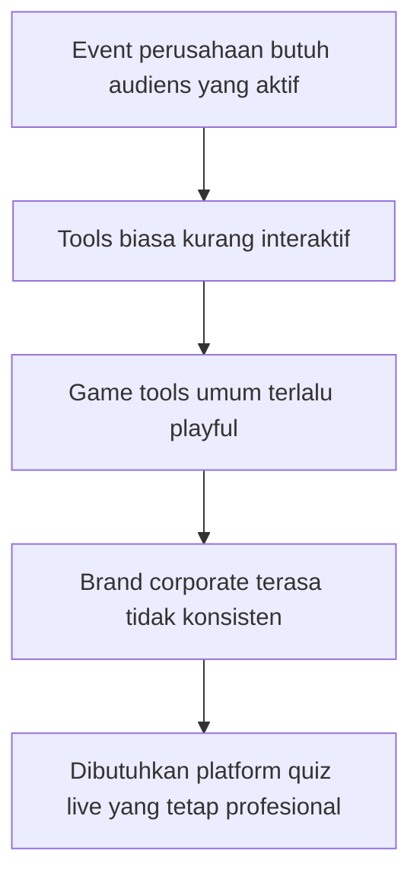

**Poin bicara**
- Event internal sering butuh ice breaking, knowledge check, atau activation.
- Solusi yang terlalu formal membuat audiens pasif.
- Solusi yang terlalu seperti game anak tidak cocok untuk brand perusahaan.
- Truevindo Games mengisi celah tersebut.

### Slide 3. Solusi yang Ditawarkan
**Pesan utama**
Truevindo Games menggabungkan interaksi real-time, kemudahan kontrol host, dan desain visual corporate dalam satu platform.

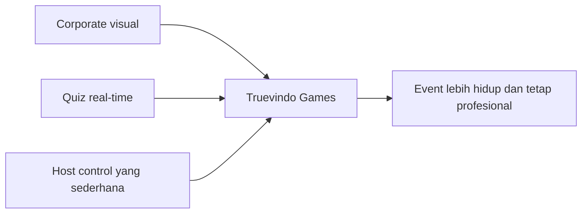

**Poin bicara**
- Partisipan cukup masuk dengan PIN dan nama.
- Host cukup mengikuti alur lurus: waiting room, mulai quiz, hasil jawaban, next, podium.
- Sistem sinkron secara real-time agar semua layar bergerak bersama.

### Slide 4. User Flow End-to-End
**Pesan utama**
Flow aplikasi sengaja dibuat sederhana agar mudah dipahami oleh operator event maupun peserta.

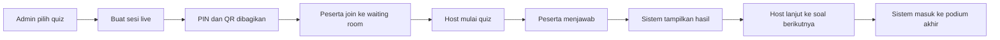

**Poin bicara**
- Tidak ada flow bercabang yang membingungkan.
- Host diarahkan langkah demi langkah.
- Setelah soal terakhir, sistem langsung mengarahkan ke podium.

### Slide 5. Flow Partisipan
**Pesan utama**
Pengalaman partisipan dibuat cepat, ringan, dan nyaman untuk mobile.

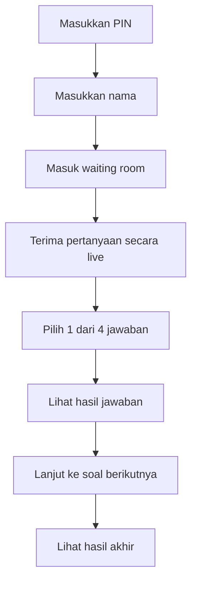

**Poin bicara**
- Tidak perlu akun untuk partisipan.
- Semua interaksi cukup melalui browser.
- UI dibuat fokus agar cepat dipahami dalam suasana event.

### Slide 6. Flow Admin / Host
**Pesan utama**
Flow host dibuat seperti operator panggung: jelas, linear, dan minim keputusan yang tidak perlu.

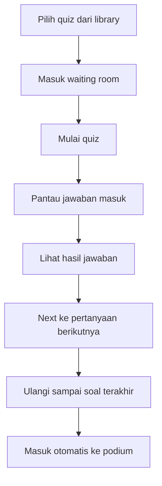

**Poin bicara**
- Host tidak perlu berpikir tentang langkah teknis.
- Tombol aksi dibuat sesuai bahasa operasional admin.
- Sangat cocok untuk MC, trainer, atau game master non-teknis.

### Slide 7. Arsitektur Sistem Sederhana
**Pesan utama**
Sistem terdiri dari frontend web, backend API, realtime gateway, dan database untuk persistence.

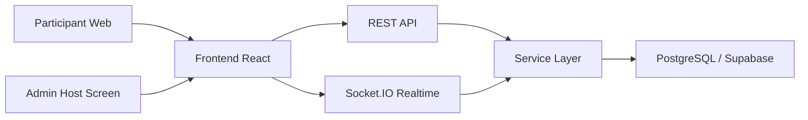

**Poin bicara**
- Frontend menangani tampilan peserta dan admin.
- Backend mengatur quiz, session, scoring, dan orchestration.
- Socket.IO menjaga sinkronisasi live.
- PostgreSQL menyimpan quiz, peserta, jawaban, dan histori sesi.

### Slide 8. Diagram Data yang Mudah Dipahami
**Pesan utama**
Struktur data dirancang sederhana: quiz memiliki pertanyaan, sesi memiliki peserta, dan jawaban tersimpan per peserta.

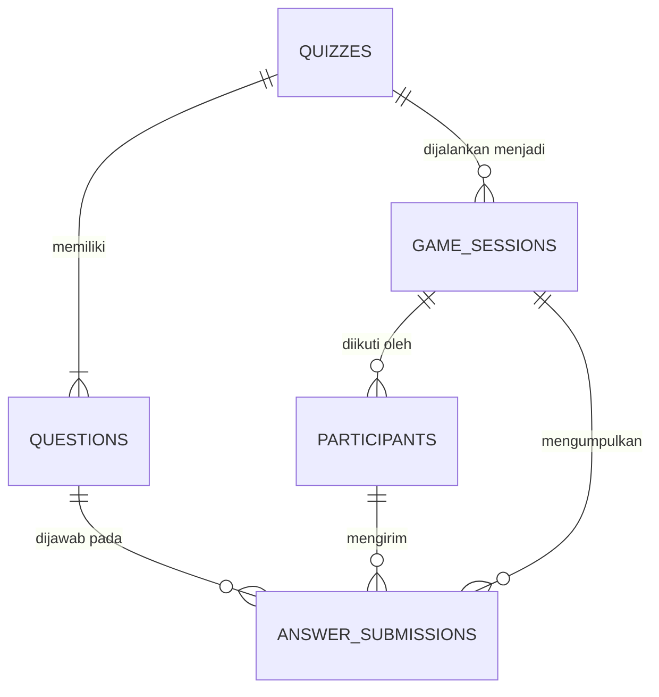

**Poin bicara**
- Quiz adalah template.
- Game session adalah instance live saat quiz dijalankan.
- Jawaban disimpan per peserta dan per pertanyaan.
- Struktur ini mendukung reporting dan analytics setelah event.

### Slide 9. Nilai Bisnis
**Pesan utama**
Truevindo Games bukan hanya alat quiz, tetapi alat engagement untuk acara perusahaan.

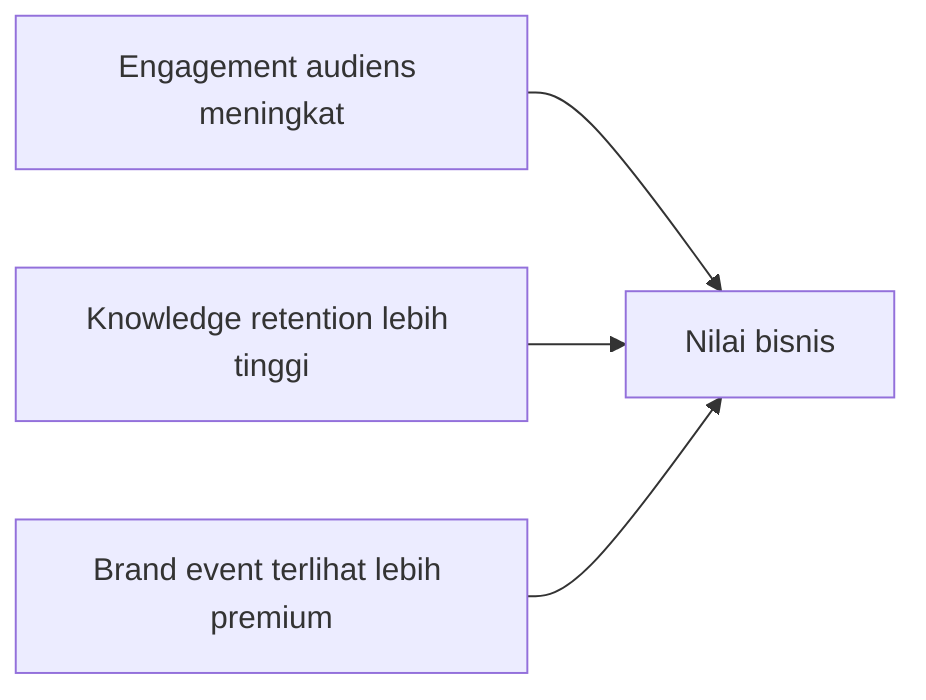

**Poin bicara**
- Cocok untuk training, onboarding, townhall, sales kick-off, dan activation.
- Menambah partisipasi aktif tanpa mengorbankan image perusahaan.
- Data hasil permainan dapat dipakai untuk evaluasi internal.

### Slide 10. Status Implementasi dan Roadmap
**Pesan utama**
Fondasi produk sudah berjalan, dan roadmap selanjutnya mengarah ke persistence penuh, reporting, dan analytics.

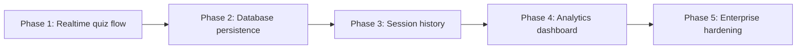

**Poin bicara**
- Realtime flow admin dan partisipan sudah terbentuk.
- Database persistence sedang diaktifkan penuh dengan Prisma dan Supabase.
- Tahap berikutnya fokus pada histori sesi, analytics, dan hardening produksi.

## 3. Ringkasan Diagram Utama

Jika hanya ingin membawa 3 diagram paling penting saat presentasi, gunakan tiga diagram ini:

### Diagram 1. End-to-End Flow
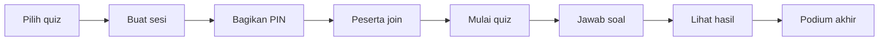

### Diagram 2. Host Flow
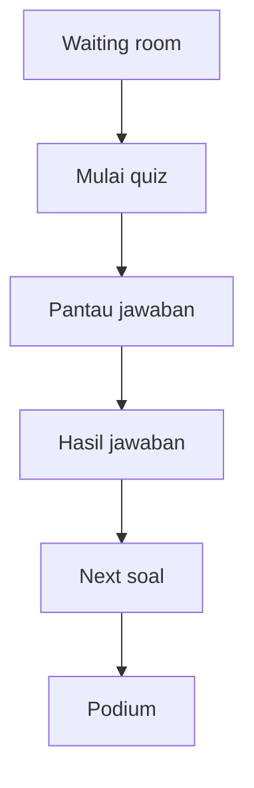

### Diagram 3. Arsitektur Sistem
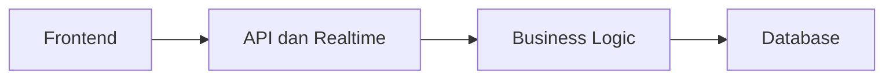

## 4. Script Bicara Singkat

Berikut versi singkat narasi yang bisa langsung dipakai saat presentasi:

> Truevindo Games adalah platform quiz interaktif real-time yang dirancang khusus untuk event perusahaan. Produk ini mengambil kekuatan engagement seperti Kahoot, tetapi dibungkus dengan pengalaman visual yang lebih corporate, lebih rapi, dan lebih mudah dikendalikan oleh host. Dari sisi pengguna, flow-nya sangat sederhana: admin memilih quiz, membuat sesi, membagikan PIN, peserta join, quiz berjalan secara live, hasil jawaban tampil langsung, lalu sesi ditutup dengan podium. Dari sisi teknis, sistem dibangun dengan frontend web, backend realtime berbasis Socket.IO, dan database PostgreSQL agar data quiz, peserta, dan hasil permainan bisa disimpan dan dianalisis. Nilai utamanya adalah engagement yang tinggi tanpa mengorbankan citra profesional perusahaan.

## 5. Tips Membawakan Presentasi

- Gunakan maksimal 1 ide utama per slide.
- Tampilkan diagram terlebih dahulu, lalu jelaskan alur dari kiri ke kanan atau atas ke bawah.
- Saat menjelaskan host flow, tekankan bahwa admin tidak dibuat bingung dengan terlalu banyak tombol.
- Saat menjelaskan arsitektur, cukup fokus pada 4 blok: frontend, API, realtime, database.
- Akhiri dengan nilai bisnis, bukan hanya fitur teknis.

## 6. Rekomendasi Slide Final

Jika ingin dibuat menjadi deck final, urutan yang paling aman adalah:

1. Judul dan positioning produk
2. Masalah
3. Solusi
4. User flow end-to-end
5. Flow admin
6. Flow partisipan
7. Arsitektur sistem
8. Struktur data
9. Nilai bisnis
10. Roadmap
