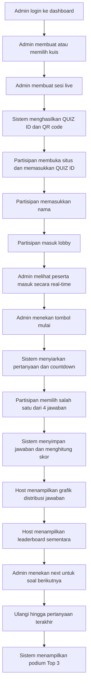

## 1. Gambaran Produk
Truevindo Games adalah platform kuis interaktif real-time untuk acara B2B, training internal, townhall, gathering perusahaan, dan activation korporat. Produk ini meniru kelancaran alur Kahoot!, tetapi dikemas dengan identitas visual yang profesional, elegan, bersih, dan siap diproyeksikan di layar presentasi perusahaan.

- Tujuan utama: menghadirkan pengalaman kuis live yang cepat, sinkron, kompetitif, dan mudah dioperasikan oleh Game Master maupun partisipan.
- Nilai bisnis: meningkatkan engagement audiens pada event perusahaan tanpa mengorbankan citra brand yang formal dan premium.

## 2. Fitur Inti

### 2.1 Peran Pengguna
| Peran | Metode Akses | Hak Akses Inti |
|------|--------------|----------------|
| Partisipan | Masuk dengan `QUIZ ID` dan nama tampilan | Bergabung ke sesi, menjawab soal, melihat status jawaban, melihat progres peringkat |
| Admin / Game Master | Login ke dashboard admin | CRUD kuis, membuat sesi live, memulai game, mengendalikan alur soal, melihat hasil real-time, menampilkan podium |

### 2.2 Modul Fitur
1. **Halaman Join Partisipan**: input `QUIZ ID`, validasi PIN, input nama.
2. **Lobby Partisipan**: status waiting, sinkronisasi status sesi, daftar peserta yang bergabung.
3. **Gameplay Partisipan**: tampilan 4 opsi jawaban, timer sinkron, status submit, benar/salah, progres ranking.
4. **Dashboard Admin**: login, daftar kuis, pembuatan kuis, edit pertanyaan, pengaturan durasi dan kunci jawaban.
5. **Host Control Screen**: QR code dan PIN sesi, waiting room, presentasi soal, grafik distribusi jawaban, leaderboard, podium.

### 2.3 Detail Halaman
| Nama Halaman | Nama Modul | Deskripsi Fitur |
|-------------|------------|-----------------|
| Join | Form PIN | Input `QUIZ ID`, validasi format, CTA lanjut |
| Join | Form nama | Input nama partisipan setelah PIN valid |
| Lobby Partisipan | Status sinkronisasi | Menampilkan status `waiting`, `starting`, `question_live`, `result`, `completed` |
| Lobby Partisipan | Daftar peserta | Menampilkan jumlah peserta dan nama yang sudah masuk |
| Gameplay Partisipan | Kartu jawaban | 4 tombol jawaban besar, dapat disentuh di mobile |
| Gameplay Partisipan | Status jawaban | Menampilkan `jawaban terkirim`, `benar/salah`, dan poin per soal |
| Gameplay Partisipan | Progress leaderboard | Menampilkan posisi relatif partisipan tanpa membuka seluruh ranking |
| Admin Login | Form autentikasi | Login email dan password untuk admin internal |
| Dashboard Admin | Daftar kuis | Tabel kuis, pencarian, filter, tombol buat baru |
| Editor Kuis | Metadata kuis | Judul, deskripsi, tema, durasi default, status draft/published |
| Editor Kuis | Builder pertanyaan | Input pertanyaan, 4 opsi, kunci jawaban, durasi, urutan |
| Host Lobby | QR dan PIN | Menampilkan `QUIZ ID`, QR code, jumlah pemain, status koneksi |
| Host Live | Presentasi soal | Menampilkan soal, opsi, countdown, progress pertanyaan |
| Host Result | Grafik jawaban | Distribusi jawaban A/B/C/D, jumlah benar, jumlah belum menjawab |
| Host Result | Leaderboard | Peringkat sementara top pemain dan delta skor |
| Host Podium | Seremoni pemenang | Highlight Top 3, Top 2, Top 1 dengan animasi corporate celebration |

## 3. Proses Inti
Partisipan membuka situs Truevindo Games, memasukkan `QUIZ ID`, lalu mengisi nama. Jika sesi valid dan masih menerima peserta, pengguna masuk ke lobby dan menunggu instruksi Admin. Ketika Admin menekan mulai, seluruh layar partisipan berpindah serempak ke mode menjawab.

Admin membuat kuis lebih dulu dari dashboard, kemudian menekan `Host/Mulai` untuk membuat sesi permainan baru. Sistem menghasilkan `QUIZ ID` dan QR code. Saat peserta terkumpul, Admin memulai pertanyaan. Setelah timer selesai atau semua peserta sudah menjawab, sistem menampilkan distribusi jawaban dan leaderboard sementara, lalu Admin menekan `Next` untuk lanjut ke pertanyaan berikutnya. Setelah soal terakhir, sistem menampilkan podium final.

## 4. Desain Antarmuka Pengguna

### 4.1 Gaya Desain
- Arah visual: corporate premium, modern minimal, clean presentation-grade, dengan nuansa keynote perusahaan.
- Warna utama: `#0F172A` untuk navy gelap, `#1E293B` untuk panel, `#F8FAFC` untuk latar terang, `#CBD5E1` untuk garis dan divider.
- Warna aksen: `#0EA5A4` untuk aksi utama, `#2563EB` untuk informasi aktif, `#F59E0B` untuk highlight skor atau podium.
- Tombol: sudut medium, permukaan solid, hover halus, tanpa efek berlebihan atau gaya kartun.
- Tipografi: `Manrope` untuk body/UI, `Sora` untuk heading dan angka skor besar.
- Ikonografi: outline clean, konsisten, memakai bentuk geometrik sederhana.
- Animasi: transisi cepat dan presisi, motion halus untuk countdown, leaderboard shift, dan podium reveal. Hindari bounce atau efek playful berlebihan.

### 4.2 Ringkasan Desain Halaman
| Nama Halaman | Nama Modul | Elemen UI |
|-------------|------------|-----------|
| Join | Hero dan form | Panel tengah, latar gradient gelap, input besar, helper text singkat, CTA primer |
| Lobby Partisipan | Waiting screen | Status badge, nama peserta, indikator sinkronisasi, layout fokus tunggal |
| Gameplay Partisipan | Grid jawaban | 4 kartu jawaban warna terkendali, timer progress ring/bar, feedback benar-salah |
| Gameplay Partisipan | Ranking progress | Progress bar posisi, badge skor, info ranking sebelumnya vs saat ini |
| Dashboard Admin | Tabel dan editor | Sidebar gelap, konten terang, tabel ringkas, form modular, action bar sticky |
| Host Lobby | PIN board | Card besar untuk `QUIZ ID`, QR code, daftar peserta live, CTA mulai |
| Host Live | Presentasi utama | Pertanyaan besar, timer dominan, indikator jumlah jawaban masuk |
| Host Result | Chart dan leaderboard | Bar chart horizontal, cards statistik, leaderboard top 10 |
| Host Podium | Celebration screen | Spotlight gradient, podium card bertingkat, confetti elegan berbasis garis atau partikel tipis |

### 4.3 Responsivitas
- Pendekatan desktop-first untuk layar host dan dashboard admin.
- Mobile-first interaction untuk layar partisipan agar nyaman dipakai melalui smartphone.
- Area sentuh jawaban minimal 48px tinggi efektif dan cukup lebar untuk jempol.
- Sinkronisasi status harus tetap terbaca pada jaringan seluler yang tidak stabil.
- Layout host dioptimalkan untuk proyektor 16:9, sedangkan layar partisipan dioptimalkan untuk portrait mobile.

### 4.4 Panduan Nuansa Corporate
- Hindari warna neon, ilustrasi imut, emoji berlebihan, atau tipografi yang terlalu playful.
- Gunakan kontras tinggi, whitespace lega, dan grid yang rapi agar cocok untuk event perusahaan.
- Pastikan leaderboard, timer, dan skor terlihat serius, seperti dashboard presentasi bisnis.
- Gunakan language tone formal-singkat pada microcopy, misalnya `Menunggu host memulai`, `Jawaban terkirim`, `Peringkat sementara`.
