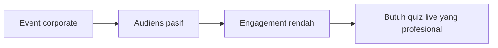
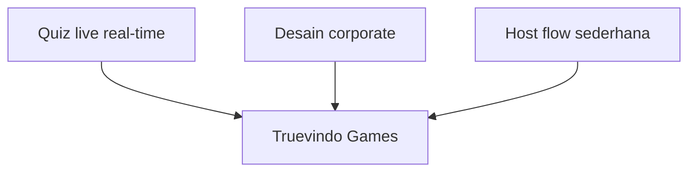
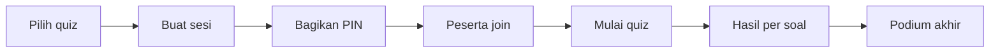
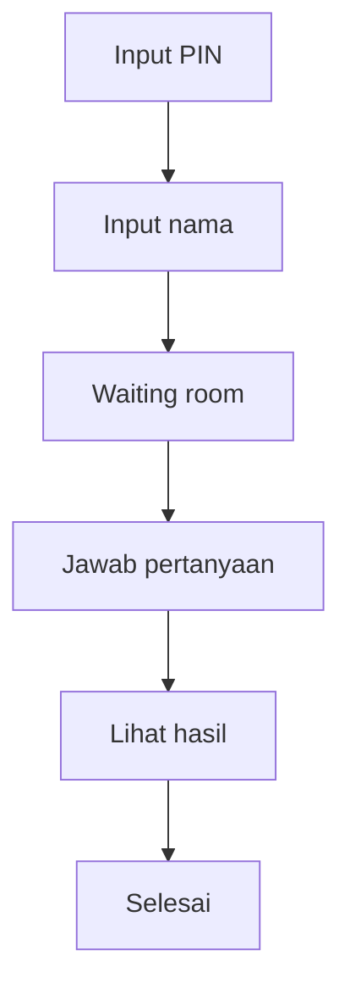
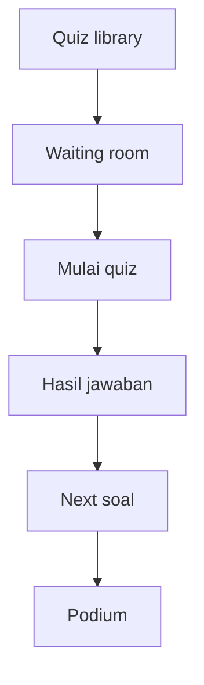
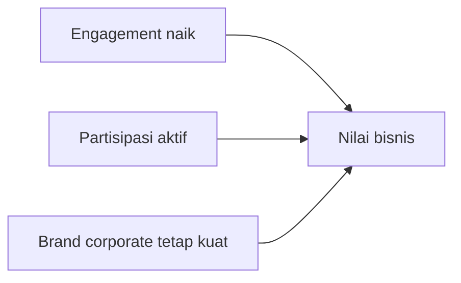
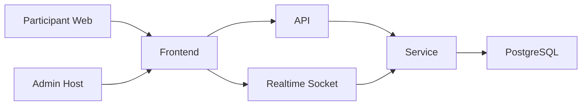
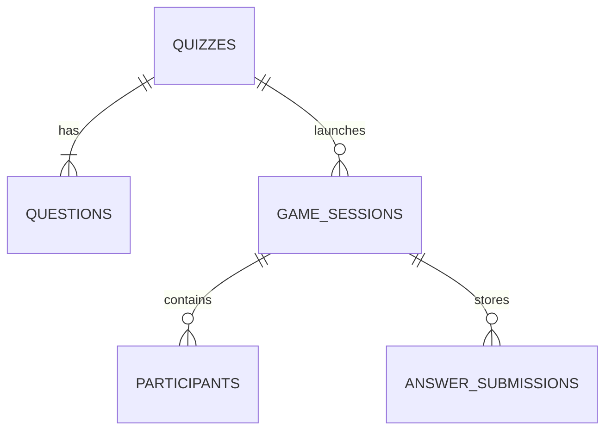
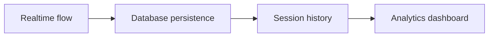

# Slide Deck Truevindo Games

Dokumen ini adalah versi slide-ready untuk dipindahkan langsung ke PowerPoint, Google Slides, atau Canva. Setiap slide sudah diringkas agar lebih enak dipresentasikan dan tidak terlalu padat.

## Cover

### Judul
**Truevindo Games**

### Subjudul
Platform Quiz Interaktif Real-Time untuk Event Corporate

### Kalimat pembuka
Menghadirkan pengalaman quiz live yang engaging, sinkron, dan tetap tampil profesional di lingkungan perusahaan.

### Elemen visual
- Background gelap navy premium
- Judul besar di kiri
- Mockup host screen dan participant screen di kanan
- Aksen teal atau blue corporate

---

## Slide 1. Latar Belakang

### Judul
Mengapa Truevindo Games Dibutuhkan

### Isi utama
- Event perusahaan butuh engagement yang aktif, bukan sekadar presentasi satu arah.
- Tools interaktif yang ada sering terasa terlalu playful untuk konteks corporate.
- Dibutuhkan platform quiz live yang tetap seru tetapi selaras dengan citra profesional.

### Kalimat presentasi
Masalah utamanya bukan hanya membuat audiens menjawab pertanyaan, tetapi membuat mereka aktif tanpa menurunkan kualitas image acara perusahaan.

### Visual slide

---

## Slide 2. Solusi

### Judul
Solusi yang Ditawarkan

### Isi utama
- Platform quiz real-time dengan flow sederhana seperti Kahoot.
- Didesain khusus untuk acara B2B, internal kantor, dan activation corporate.
- Host dan peserta bergerak sinkron dalam satu sesi live.

### Kalimat presentasi
Truevindo Games mengambil kekuatan interaktif dari quiz live, lalu membungkusnya dengan pengalaman visual dan operasional yang lebih cocok untuk perusahaan.

### Visual slide

---

## Slide 3. Cara Kerja Singkat

### Judul
Cara Kerja End-to-End

### Isi utama
- Admin memilih quiz dan membuat sesi live.
- Sistem menghasilkan PIN dan QR code untuk peserta.
- Peserta join, quiz dimulai, hasil tampil, dan sesi berakhir di podium.

### Kalimat presentasi
Flow dibuat lurus dan mudah dipahami, sehingga admin tidak perlu belajar sistem yang rumit saat event sedang berjalan.

### Visual slide

---

## Slide 4. Flow Partisipan

### Judul
Pengalaman Partisipan

### Isi utama
- Peserta hanya perlu memasukkan PIN dan nama.
- Setelah masuk waiting room, peserta akan mengikuti alur game secara otomatis.
- Jawaban dikirim cepat melalui tampilan mobile-friendly dengan 4 opsi besar.

### Kalimat presentasi
Pengalaman partisipan dibuat sesederhana mungkin agar siapa pun bisa ikut tanpa pelatihan, cukup lewat browser di smartphone.

### Visual slide

---

## Slide 5. Flow Admin / Host

### Judul
Pengalaman Admin yang Mudah Dipahami

### Isi utama
- Admin memilih quiz dari library dan masuk ke waiting room.
- Saat peserta siap, admin cukup menekan mulai quiz.
- Setelah setiap soal, admin hanya perlu lanjut ke hasil lalu ke soal berikutnya hingga podium.

### Kalimat presentasi
Host diposisikan seperti operator acara: fokus pada jalannya quiz, bukan pada istilah teknis atau tombol yang membingungkan.

### Visual slide

---

## Slide 6. Nilai Produk

### Judul
Apa Nilai Utamanya

### Isi utama
- Meningkatkan engagement audiens dalam event perusahaan.
- Membantu knowledge check, training, dan activation menjadi lebih hidup.
- Menjaga tampilan event tetap premium dan konsisten dengan brand.

### Kalimat presentasi
Nilai Truevindo Games bukan hanya pada gamification, tetapi pada kemampuan membuat acara lebih aktif tanpa kehilangan nuansa profesional.

### Visual slide

---

## Slide 7. Arsitektur Sistem

### Judul
Arsitektur Sistem Secara Sederhana

### Isi utama
- Frontend web menangani layar participant dan admin host.
- Backend mengelola quiz, session, scoring, dan kontrol permainan.
- Realtime dijalankan dengan Socket.IO dan data disimpan di PostgreSQL.

### Kalimat presentasi
Dari sisi teknis, arsitektur dibuat sederhana namun kuat: ada frontend, backend, realtime, dan database yang saling mendukung.

### Visual slide

---

## Slide 8. Struktur Data

### Judul
Bagaimana Data Tersimpan

### Isi utama
- Quiz menyimpan metadata dan daftar pertanyaan.
- Game session menyimpan instance permainan yang sedang berjalan.
- Jawaban, peserta, dan leaderboard dapat disimpan untuk reporting.

### Kalimat presentasi
Struktur data ini membuat sistem tidak hanya bisa menjalankan game secara live, tetapi juga menyimpan histori untuk evaluasi sesudah event.

### Visual slide

---

## Slide 9. Status Saat Ini

### Judul
Progres Implementasi

### Isi utama
- Flow realtime admin dan partisipan sudah terbentuk.
- Quiz builder, quiz library, host flow, dan participant flow sudah tersedia.
- Persistence database sedang diarahkan ke Prisma dan Supabase/PostgreSQL.

### Kalimat presentasi
Secara produk, fondasi live quiz sudah ada. Fokus berikutnya adalah memperkuat persistence, histori sesi, dan analytics.

### Visual slide

---

## Slide 10. Penutup

### Judul
Truevindo Games dalam Satu Kalimat

### Isi utama
- Quiz live yang interaktif
- Flow admin yang sederhana
- Tampilan yang corporate dan premium

### Kalimat penutup
Truevindo Games adalah solusi quiz live yang membuat event perusahaan lebih aktif, lebih modern, dan lebih berkesan tanpa kehilangan identitas profesional.

### CTA presentasi
- Siap dipakai untuk training internal
- Siap dikembangkan untuk activation corporate
- Siap diperluas ke reporting dan analytics

---

## Catatan Desain Slide

### Palet warna yang disarankan
- Navy gelap: `#0F172A`
- Slate panel: `#1E293B`
- Teal aksen: `#0EA5A4`
- Blue aksen: `#2563EB`
- Putih teks utama: `#F8FAFC`

### Tipografi yang disarankan
- Heading: `Sora`
- Body: `Manrope`

### Gaya visual
- Minimalis corporate
- Banyak whitespace
- 1 diagram atau 1 ide utama per slide
- Hindari slide yang terlalu padat teks

## Versi Presentasi 5 Menit

Jika Anda ingin versi sangat singkat, gunakan hanya 5 slide ini:

1. Cover
2. Masalah
3. Solusi dan flow end-to-end
4. Arsitektur sederhana
5. Nilai bisnis dan roadmap

## Script Presentasi Singkat

> Truevindo Games adalah platform quiz interaktif real-time yang dirancang untuk event corporate. Solusi ini menjawab kebutuhan perusahaan yang ingin membuat audiens lebih aktif tanpa menggunakan tampilan game yang terlalu playful. Flow-nya sederhana: admin memilih quiz, membuat sesi, peserta join dengan PIN, quiz berjalan secara live, hasil muncul setiap ronde, lalu ditutup dengan podium. Dari sisi teknis, sistem dibangun dengan frontend web, backend realtime, dan database yang mendukung persistence. Hasil akhirnya adalah platform engagement yang profesional, interaktif, dan siap dikembangkan lebih jauh untuk reporting serta analytics.
